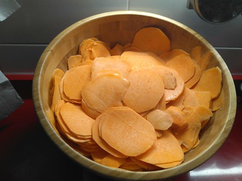
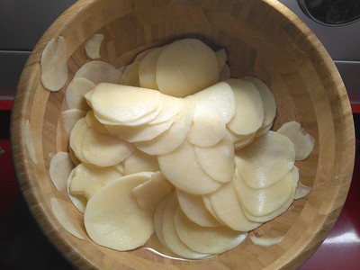
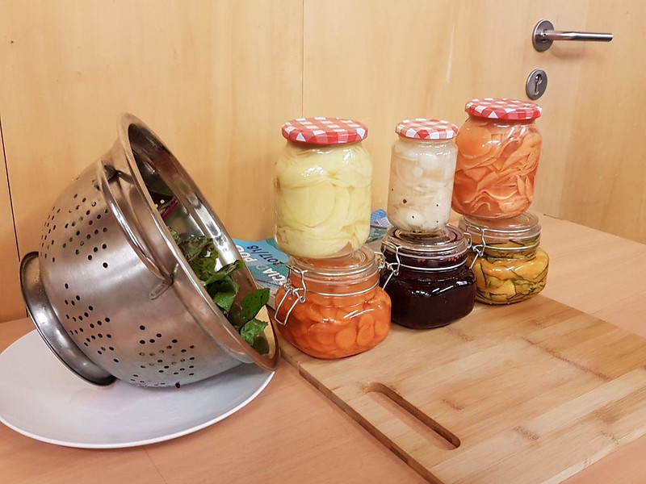
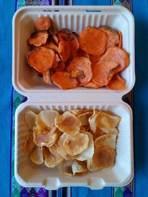
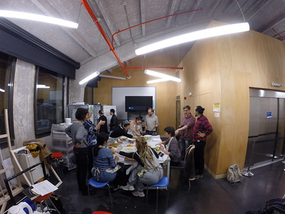

---
# Feel free to add content and custom Front Matter to this file.
# To modify the layout, see https://jekyllrb.com/docs/themes/#overriding-theme-defaults
id: chips
title: Chips
layout: page
---

# PROTOTIPADO DE CHIPS

A partir de una pequeña selección de los alimentos y de una lluvia de ideas donde los integrantes de Cocina Microbiótica comparten desde su conocimiento las fortalezas de los fermentos para la concepción de nuestro snack, damos inicio a las primeras pruebas con calabaza, remolacha, zanahoria, nabo, boniato y patata fermentadas en agua sin cloro con sal al 2%. Las primeras cuatro son deshidratadas y las últimas dos horneadas a baja temperatura en un tiempo corto. Probamos y reservamos la mejor para servir.

## Semana 1 <small>(11 al 15 de noviembre)</small>

1. Selección de procesos de cocinado del producto, elegimos la fermentación previa para dotar al producto final de las características organolépticas y de alimentos saludables( pre y probióticos) que tienen los alimentos fermentados.

2. Elegimos alimentos de temporada y de kilómetro 0:
- patata
- boniato
- calabaza
- nabo
- zanahoria
- remolacha

3. Compramos los productos a unos agricultores de la Comunidad de Madrid en la feria Biocultura.
4. Realizamos la fermentación el viernes 8 de noviembre 2019 a las 18.00

### RECETAS Y ELABORACIÓN:

#### Zanahoria:

**Ingredientes:**
- Zanahoria
- Agua sin cloro
- Sal al 2%

**Elaboración:**
1. Cortar con mandolina muy fina.
2. Echar en un bol con sal y masajear.
3. embotar hasta arriba para que no entre oxigeno en el bote y malogre el fermentado.

#### Calabaza:

**Ingredientes:**
- Calabaza
- Agua sin cloro
- Sal al 2%
- Zumo mandarina
- Pimienta rosa

**Elaboración:**
1. Cortar con mandolina muy fina.
2. Echar en un bol con sal y masajear.
3. Añadir zumo de mandarina y cáscara.
4. Embotar hasta arriba para que no entre oxígeno en el bote y malogre el fermentado.

#### Remolacha:

**Ingredientes:**
- Remolacha
- Cáscara de limón
- Sal al 2%
- Zumo de naranja
- Agua sin cloro
- Semillas de cilantro

**Elaboración:**
1. Cortar con mandolina muy fina.
2. Echar en un bol con sal y masajear.
3. Añadir zumo de naranja y cáscara de limón.
4. Embotar hasta arriba para que no entre oxígeno en el bote y malogre el fermentado.

#### Nabo:

**Ingredientes:**
- Nabo
- Sal al 2%
- Comino negro
- Semillas de mostaza
- Agua sin cloro
- Semillas de cilantro

**Elaboración:**
1. Cortar con cuchillo muy fino.
2. Echar en un bol con sal y masajear.
3. Añadir semillas de mostaza y comino negro.
4. Embotar hasta arriba para que no entre oxígeno en el bote y malogre el fermentado.

#### Patata:

**Ingredientes:**
- Patata
- Sal al 2%
- Agua sin cloro

**Elaboración:**
1. Cortar con cuchillo muy fino.
2. Echar en un bol con sal y masajear.
3. Embotar hasta arriba para que no entre oxígeno en el bote y malogre el fermentado.

#### Boniato:

**Ingredientes:**
- Boniato
- Sal al 2%
- Agua sin cloro

**Elaboración:**
1. Cortar con cuchillo muy fino.
2. Echar en un bol con sal y masajear.
3. Embotar hasta arriba para que no entre oxígeno en el bote y malogre el fermentado.

<blockquote>La idea es que la patata y el boniato se horneen porque crudos, aunque estén fermentados ,no pueden consumirse ya que pueden ser nocivos para la salud. así que queremos hornearlos a 180º durante 1 hora más o menos, después enfriarlo a 5º durante 24 horas y después deshidratarlo. A ver cómo resulta ;-)</blockquote>

## Semana 2  <small>(11 al 27 de noviembre)</small>

La fermentación está sucediendo en todos los fermentados. 
Ha estado fermentando 72 horas a una temperatura constante de 20º.

Comenzamos a deshidratar fermentados a ver cómo quedan y ver los tiempos que necesita cada alimento. 
Ponemos en la deshidratadora; calabaza, remolacha, nabo y zanahoria, cada alimento en una bandeja.

La fermentación está suave, tiene poco sabor por el momento. 
La deshidratación a 40º durante 21 horas para no matar ninguna enzima ni microorganismos que hemos ayudado a proliferar durante el proceso de fermentación, de esta forma conseguimos que sea un alimento cargado de probióticos vivos.

Dejamos los fermentos en nevera para evitar contaminaciones y que ralentice el proceso fermentativo.

### PLAN DE HORNEADO

Hornear a 180º durante entre 30 minutos y 1 hora.

Una vez asados, una parte, los enfriamos en cámara a 5º durante al menos 4 horas para conseguir convertir el almidón de la patata en fibra prebiótica. 
Al asar la patata y el boniato los almidones se hidratan y se hacen digeribles. Al refrigerar, parte de estos almidones, se cristalizan convirtiéndose en almidones resistentes, una fibra altamente fermentable para las bacterias de la microbiota intestinal.

### PRIMERA PRUEBA DE HORNEADO

Boñato y patata:
1. 28 minutos 180º 
**Resultado:** Chips quemados
2. 15 minutos 180º 
**Resultado:** Cocción no uniforme: bordes quemados e interior crudo

***Conclusiones:*** Las próximas pruebas se trabajarán en el mismo horno a una temperatura más baja (100º) y mayor duración de tiempo (>30 minutos)

### 13 noviembre

<table>
<tr>
  <th>Producto</th><th>Tiempo</th><th>Resultado</th>
</tr>
<tr>
  <td>Zanahoria</td><td>21h</td><td>se ha quedado muy gomoso</td>
</tr>
<tr>
  <td>Calabaza</td><td>34h</td><td>tipo papel de fumar</td>
</tr>
<tr>
  <td>Remolacha</td><td>26h</td><td></td>
</tr>
<tr>
  <td>Nabo</td><td>21h</td><td>crujiente pero muy finito</td>
</tr>
</table>

## Semana 3

### Taller de fermentados en BioLab.

La primera parte del taller trata sobre el proceso de fermentación, es una parte más teórica enfocada a la comprensión de qué es, qué conseguimos y qué aporta a nuestra vida y a nuestra salud la fermentación de los alimentos…

Después nos ponemos a fermentar entre tod@s los alimentos que van a formar parte de nuestra nueva investigación de alimentos fermentados y su posterior proceso de deshidratación:

- 1 pieza de calabaza dulce
- 1 trozo de calabaza cuello torcido
- 2 nabos
- 3 colinabos
- Sal de mar ecológica
- Agua sin cloro

El proceso de fermentación que realizamos es una mezcla entre una fermentación salvaje, echando la sal y masajeando el alimento para que suelte su propia agua y una fermentación en salmuera para rellenar los botes hasta arriba y así evitar posibles contaminaciones por contacto con el oxígeno.

Esta vez el producto lo cortamos de mayor grosor para ver cómo resulta a la hora de fermentar y lo pelamos para evitar que la cáscara se quede dura cuando deshidratamos como nos pasó en la tanda anterior. Algunos trozos de colinabo llegan a pesar 46 gr y de calabaza unos 16gr.

### 22 noviembre:

Hemos dejado los fermentos 4 días y se ha generado mucho gas carbónico, cuando los abrimos están burbujeantes y efervescentes, uno de los botes de colinabo se desborda literalmente.
La calabaza de cuello torcido se ha deshecho prácticamente, es muy fibrosa y tiene mucho azúcar. La calabaza dulce ha aguantado mejor la fermentación pero también se ha deshecho un poco.

Ponemos el producto a deshidratar durante 25 horas a 45º:

- 3 bandejas de colinabo
- 1 bandeja de calabaza
- 1 bandeja de nabo

### 23 noviembre:

Ponemos a fermentar:

- 1.240 kg de patata blanca
- 1.625 kg de boniato naranja

Los alimentos que habíamos dejado deshidratando quedan algo gomosos, suponemos que es porque el grosor era demasiado, así que añadimos 17 horas más de deshidratación.

Añadimos a deshidratar 17 horas a 40º:

- 1 bandeja de calabaza
- 1 badeja de remolacha de la 1ª tanda de fermentación
- 1 bandeja de nabo de la 1ª tanda de fermentación
- 2 bandejas de colinabo de la 2ª tanda de fermentación

### 24 noviembre:

Las pruebas de deshidratación no resulta cómo queríamos, casi todas las muestras quedan gomosas. 
La calabaza está muy fibrosa y cuesta masticarla. 
La remolacha es la que mejor ha resultado pero mantiene algo de humedad. 
El colinabo no puede casi ni masticarse. 
El Nabo de primera prueba queda modo bolita.

## Semana 4

### 25 noviembre:

Horneamos la patata y el boniato 10” a 150º y otros 20” a 180º y conseguimos una textura crujiente. En el transporte perdemos la textura porque tenemos que meterlo en un recipiente de plástico, así que ponemos a deshidratar a 70º durante 3 horas.
