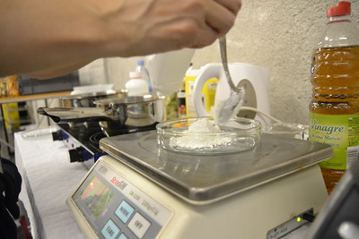
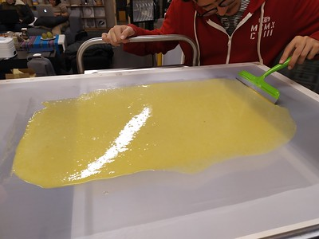
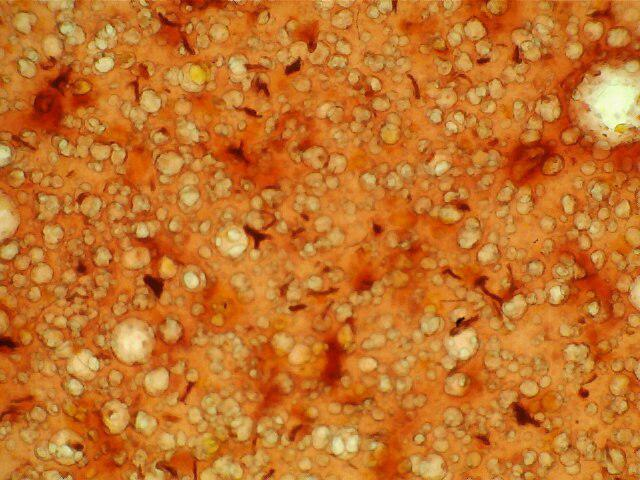
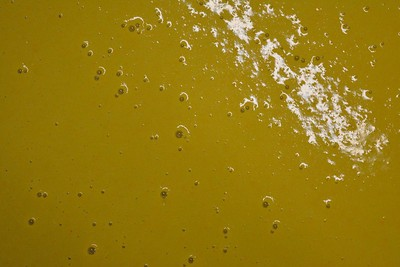
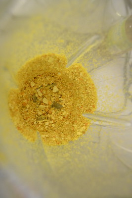

---
# Feel free to add content and custom Front Matter to this file.
# To modify the layout, see https://jekyllrb.com/docs/themes/#overriding-theme-defaults
id: biopolimeros
title: Biopolímeros
layout: page
---
# PROTOTIPADO DE BIOPOLÍMERO  <small>(BIOPLÁSTICO)</small>

Cocinar a fuego lento una masa consistente de experimentos hasta lograr un biopolímero biodegradable y biocompostable a partir de productos y subproductos (residuos) orgánicos / vegetales para la creación de un empaque sostenible, el mejor de ellos fue trabajado con cáscaras de mandarina, té de hibisco, glicerina, almidón de maíz y vinagre. Optimizamos y reservamos.

## BIOPLÁSTICO DE FÉCULA DE MAÍZ
Cantidades:
- Cáscaras de tres mandarinas licuadas con 400ml de agua
- Un puñado de hibiscus para usar como colorante.
- 1 taza caliente. 250ml
- 25gr de fécula de maíz en frío
- 2gr/ 1 cuch de glicerina

Añadir al agua de hibiscus la fécula y luego la glicerina, mezcla templada. Mezclar a fuego medio hasta que no tenga grumos y una consistencia gelatinosa Mezclar con la mitad de la mezcla de colorante vegetal hasta que quede una mezcla homogénea. Vertir en una superficie plana

## BIOPLÁSTICO DE PATATA EN FRÍO CON AGUA PURA

Cantidades:
- 25gr de fécula de patata en frío 2gr/
- 1 cuch de glicerina

Mezclar al calor hasta que no tenga grumos y una consistencia gelatinosa Mezclar con la mitad de la mezcla de colorante vegetal hasta que quede una mezcla homogenea Vertir en una superficie plana

## BIOPLÁSTICO DE AGAR AGAR
Cantidades:
- 120ml de agua caliente
- 4grm Agar purificado en polvo
- 6ml de glicerina

Mezclar polvo de melva Calentar y remover hasta que se alcancen 95 grados o empiece a formar espuma Vertir en una superficie plana

## Receta 3.0 bioplástico Sol de Noche

- Almidón o fécula de maíz (20-30 gr.)
- Agua (1 taza de té de hibiscus)
- Vinagre blanco (1 cucharada sopera / 30 ml)
- Cáscara de mandarina
- Glicerina (1 cucharada sopera / 30 ml)

Se mezcla la fécula de maíz con el agua (té de hibisco) en frío, luego se añade una cucharada de vinagre y una cucharada de glicerina. Revolver todo hasta que quede bien integrado sin grumos.
Luego se enciende el fuego y se mezcla, si aparece algún grumo deshacerlo. Si está muy espeso se puede agregar hasta una taza más de agua.
Paralelo a eso licuar la cáscara de mandarina (o la fruta que se quiera usar) junto con una taza de agua.
Luego integrar a la mezcla de cáscaras de mandarina que se encuentra en la licuadora la mezcla de la fécula con la glicerina y el vinagre acabada de salir de cocción. Batir hasta lograr un líquido espeso y homogéneo. Listo! Masa de bioplástico lista para servir uniformemente en la lámina de cristal o metacrilato para el secado y laminado.

## 1ª PRUEBA FREAK  <small>[ remolacha + papel + maizena]</small>

Hemos hecho el doble de la mezcla mágica que ya nos había [funcionado](https://www.youtube.com/watch?v=qNN6oOjIic4)
- 500ml de agua
- 50gr de vinagre
- 50gr de glicerina
- 50gr de maicena
- Tallos de remolacha + agua

Se calienta todo salvo los tallos de remolacha y se remueve hasta que forma una masa espesa. 
Para el engrudo de fibra hemos sustituido la piel de mandarina que usamos por tallos de remolacha, que hemos mezclado con 40ml de agua (mucha agua, para los tallos que no estaban deshidratados y bastante acuosos). Luego lo hemos triturado todo.
Al extenderlo ha empezado el espectáculo, al estar demasiado líquida la mezcla se ha filtrado por la malla de serigrafía.

Hemos secado con papel. Hemos decidido aprovechar ese papel (ya que es fibra y estábamos inspirados) y lo hemos triturado en la mezcla. Nos ha quedado un engrudo muy gordo.

Hemos hecho una mezcla de glicerina, agua y agar [ receta de bioplástico] para añadirle más estructura plástica a la mezcla final, en las siguientes proporciones:
- 6,4 agar agar
- 19,7 gr de glicerina
- 200 gr de agua caliente

Se mezcla todo y se lleva al fuego hasta que comienza a salir espuma o alcanza 90º, sin parar de remover.

Nosotras hemos revuelto y revuelto pero no engordaba y las partículas de agar agar no se han disuelto]

Hemos triturado todo y extendido la super mezcla sobre la plancha de vidrio.

## SEGUNDA PRUEBA  <small>[ polvo de mandarina + maizena]</small>

- 500ml de infusión de hibiscus
- 50gr de maizena
- 50gr de glicerina
- 50gr de vinagre
- polvo de mandarina

Se mezcla todo salvo el polvo de mandarina y cuándo la maizena está disuelta se lleva al calor y remueve uniformemente hasta que espesa.

Entonces hemos triturado la mezcla con el polvo de mandarina y un poco de agua [ añadir cantidades].

Y extendido sobre la malla de serigrafía.
