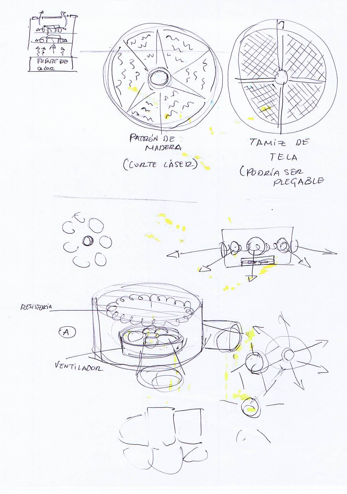
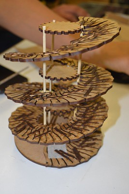

---
# Feel free to add content and custom Front Matter to this file.
# To modify the layout, see https://jekyllrb.com/docs/themes/#overriding-theme-defaults
id: deshidratador
title: Deshidratador
layout: page_lang
---
# PROTOTIPADO DE DESHIDRATADOR <small>DIY (de alcance para producción comercial a pequeña escala)</small>
Cortar ideas para el diseño y prototipado de un deshidratador de alimentos DIY de alcance comercial. Probar los diferentes puntos de eficacia y una vez definido, agregar una pizca de selección, llevar al fuego y reservar.

 
