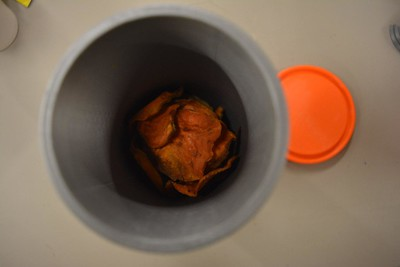
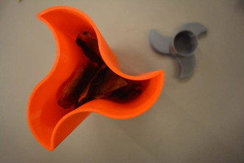

---
# Feel free to add content and custom Front Matter to this file.
# To modify the layout, see https://jekyllrb.com/docs/themes/#overriding-theme-defaults
id: empaque
title: Empaque
layout: page_lang
---
# PROTOTIPADO EMPAQUE Y DISEÑO GRÁFICO

 

Emplatar los aspectos visibilizados en el desarrollo del diseño gráfico del producto transmitiendo al consumidor el conocimiento del origen y la historia del producto de manera ágil, atractiva y divertida.
