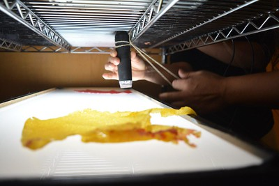
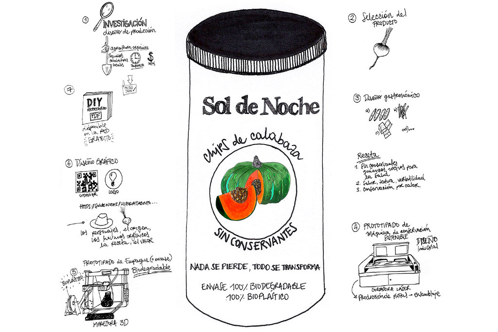

# DIWO  <small>(do it with others)</small>

Servir las piezas de documentación para la degustación de los comensales en versiones de videoarte, recetario ilustrado y maquetación gráfica que serán compartidas en la web.

La idea de los datos abiertos, está basada en la exposición de nuevos métodos, nuevas maneras de compartir y conocer para poder crear, basado idealmente en la filosofía del manifiesto gastrosófico que se encuentra al inicio de este documento.

  <a href="#" class="button primary">Descargar</a>

