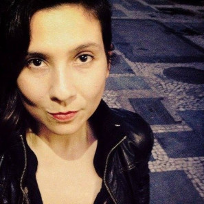
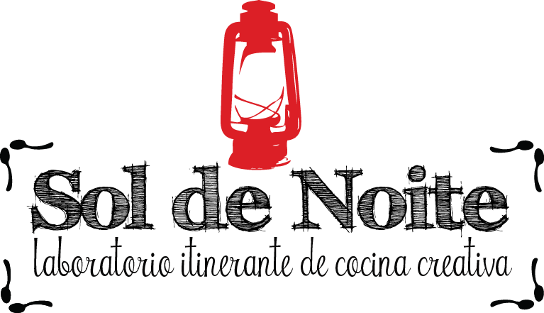

<h1 id="sol-de-noche">Sol de Noche</h1>
<h2 id="ingrid-cuestas-i-gastrósofa-bogotá-colombia">Ingrid Cuestas I Gastrósofa  <small>[Bogotá, Colombia]</small></h2>
<h3 id="artista-visual-en-residencia-en-medialab-prado-del-1-al-31-de-noviembre-de-2019">Artista Visual Residencia en Medialab Prado del 1 al 31 de noviembre de 2019</h3>

Maestra en Artes Visuales con énfasis en expresión audiovisual, gastrósofa, artivista y cocinera empírica. Ganadora de la Residencia Plataforma Bogotá - Medialab Prado del Programa Distrital de estímulos del Idartes 2019. Desde 2005 explora los lenguajes del dibujo, el videoarte y la instalación. En 2008 comienza a apropiarse de la deriva como método de investigación, aprendizaje, creación y resistencia política. En 2011, se declara nómada y crea el Sol de Noite : Laboratorio Itinerante de Cocina Creativa, proyecto con el que lleva 9 años recorriendo América del Sur bajo el lema: el sur es nuestro norte. Cuestas propone el laboratorio de creación colectiva y multidisciplinaria Sol de Noche durante su residencia en Madrid, con el ánimo de provocar curiosidades y construir colectivamente nuevos imaginarios desde el arte, la ciencia, la tecnología y la interdisciplinariedad, que apunten al alcance de la soberanía alimentaria desde el entendimiento de la economía y la sociedad actual.

“<em>¡Que se enciendan las papilas y estallen las pupilas!

Queremos aromas de colores estridentes, texturas que nos hagan cambiar de piel, sabores de notas infinitas, agudas, graves, picantes, agridulces, cálidas, perfumadas, crocantes, capaces de revolucionar los oídos y de embriagarnos hasta la punta del pie.

Nos aventuramos sin reservas en la búsqueda de la piedra gastrosofal en el camino infinito del goce, borramos las líneas imaginarias que separan al alquimista del pincel y la tinta, bajamos de la falsa altura para volver a mirar de hombro a hombro  a  la  poetisa  del  día  a  día,  la  provocadora,  la insurrecta: la cocina.

…Comer es una acción análoga al ejercicio del pensamiento, cocinar un acto poético, político y artístico. En cada trozo saboreado devoramos bocados de realidad o fantasía, amor o violencia,  sueños  o  resignaciones,  abuso  o  justicia, cada alimento tiene una historia, un planteamiento social, económico y antropológico.

Nos interesan los personajes que día a día labran la tierra para entregarnos el alimento, les agradecemos por bendecirnos con su arduo trabajo. Aborrecemos a todos aquellos mercenarios que se enriquecen de forma exponenciada gracias al trabajo del honesto.

<a href="https://www.ingridcuestas.com" target="_blank">https://www.ingridcuestas.com</a>

Apoyamos al pequeño productor, la tienda de barrio, el centro de abastos, el mercado campesino, la cocina artesanal, el cultivo orgánico, los productos locales y de temporada. Tiramos abajo las cadenas industriales, de comercio y de cualquier forma de opresión instaurada por las multinacionales y el neoliberalismo. Queremos que caiga la economía global y sus tiranos…</em>”

Fragmentos del <a href="https://www.ingridcuestas.com/manifiesto-gastrosofico">Manifiesto Gastrosófico del Sol de Noite</a>

<h2 id="presenta--sol-de-noche">Presenta:   “SOL DE NOCHE”</h2>
<h3 id="laboratorio-de-creación-colectiva-interdisciplinaria-y-horizontal-diwo-do-it-with-others">Laboratorio de creación colectiva, interdisciplinaria y horizontal DIWO (do it with others)</h3>

<h4 id="historia-de-la-receta">Historia de la receta:</h4>

Este proyecto nace de la inquietud de la artista sobre cómo contribuir al buen vivir desde el arte relacional, político y multidisciplinario, el espíritu maker, el trabajo colaborativo y el dulce olor de la palabra escrita en su manifiesto gastrosófico que reúne los pilares de su tratado estético sobre la gastrosofía, donde reivindica la cocina como lugar de encuentro, lenguaje artístico capaz de revolucionar todos los sentidos y núcleo de acción política desde el arte relacional. La pregunta constante sobre cómo incidir dentro de la cadena de consumo para dar pasos colectivos desde la voluntad ciudadana hacia un “Know How” que apunte a la consecución de la soberanía alimentaria de los pueblos, entendiendo el estado del arte de la cultura y la economía sostenible enfocado en la alimentación consciente.

El laboratorio desarrolló una serie de talleres colaborativos, colectivos, experimentales, horizontales y multidisciplinarios de investigación, creación, preparación y conservación de alimentos, experimentación con biomateriales para la creación de un biopolímero a partir de productos y subproductos orgánicos, diseño, ilustración y vídeo, en los cuales desarrollamos un prototipo de producto alimenticio de consumo rápido (snack), artesanal, libre de conservantes y preservantes químicos, basado en la agricultura orgánica, los productos locales y de temporada, la compra al pequeño productor; la voluntad de crear un  empaque biodegradable y biocompostable a partir de cáscaras de frutas, productos y residuos orgánicos; aspectos visibilizados en el desarrollo del diseño gráfico del producto que transmite el conocimiento del origen, la historia del producto y su productor al consumidor de manera ágil, atractiva y divertida.

Toda la investigación estará abierta al público en forma de manual hazlo tu mismo (DIY) disponible en la web, incentivando la cultura de datos abiertos y la multiplicación de este tipo de apuestas, promoviendo el crecimiento del conocimiento empírico y simbiótico.

